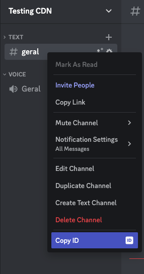

# Discord as CDN


## How to run your project
first create a `.env` file and add your bot token, you can follow with the `.env.example` file

then run the following commands

```bash
go mod download
go run main.go
```
then you can do a call to the ``/sendFile`` endpoint, passing the file as form-data with the name of ``file``, you can check the example in the ``example`` folder

when you send the file, the server will answer with the url of the file like this:

```json
{
"url": "link"
}

```
## Why?

It's a free service to store your photos dynamically, instead of hosting on your server and spending more money. 

As said one of my friends([NicolasLopes7](https://github.com/NicolasLopes7)) and owner of the [repo](https://github.com/NicolasLopes7/dontUseCDN-UseDiscord) that I took inspiration from.


### Setup and how to get .env information

First you need to add your bot to your server:
1. Go to [Discord Developer Portal](https://discord.com/developers/applications)
2. Create a new application
3. get the client id and add it to the url below and open it in your browser.

```
https://discord.com/oauth2/authorize?client_id=YOUR_CLIENT_ID&scope=bot
```

this will redirect you to a page where you can select the server you want to add the bot to.


#### BOT_TOKEN
1. Go to [Discord Developer Portal](https://discord.com/developers/applications).
2. Select your application or create a new one following the steps to add the bot to your server.
3. Go to the bot tab
4. Create a new bot
5. Copy the token
6. Paste it in the .env file as the value of the DISCORD_TOKEN variable

#### DISCORD_CHANNEL_ID
1. Make sure you have the developer mode enabled in your discord settings.
2. Right-click on the channel you want to use and click on copy id. you can check the image below.
3. Paste it in the .env file as the value of the DISCORD_CHANNEL_ID variable

_copy id_:




## Next steps?

Make a generic endpoint so that you can send in a post request other informations so that this can be used inside more easily by indie developers, would go something like this:
```json
{
  "file": "...",
  "botToken": "...",
  "channelID": "..."
}
```
